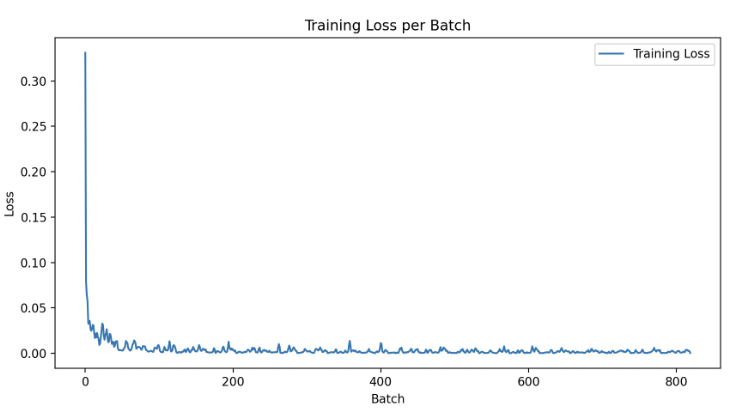
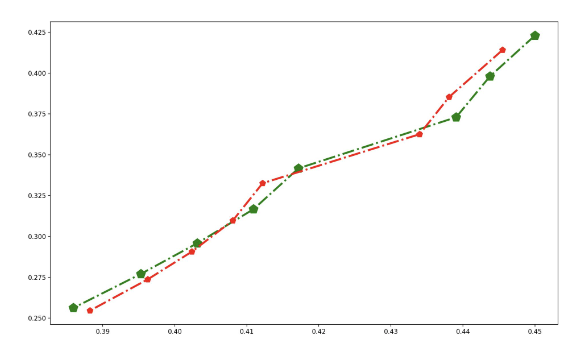

# Object Detection with YOLO v8

This project showcases object detection using YOLO v8, extended with LSTM and linear regression models for predicting object trajectories in video streams. The project is divided into two main components: `yolo-v8-LSTM` for LSTM-based prediction and annotation, and `yolo-v8-regression` for a streamlined regression-based approach.

## Repository Structure

- **yolo-v8-LSTM**: This directory contains scripts for detecting objects in video using YOLO v8, exporting detection data to CSV, and applying LSTM models for trajectory prediction. Annotated videos are saved and can be played automatically.
  - `detect.py`: Detects objects in `./data/video/test_video.mp4`, exports detections to `./video_data` in CSV format.
  - `train_video.py`: Utilizes LSTM model for predicting object trajectories, annotates video with predicted trajectories, plays, and saves to `./output`.
  - `train.py`: Applies `DataLoader` for processing CSV files, trains LSTM model, and generates visualization outputs.
  - `dataset.py`: Contains `DataLoader` for batching CSV data.
  - `visual.py`: Generates visual outputs for model training and predictions.
  
- **yolo-v8-regression**: Contains a script for real-time object detection and trajectory prediction using linear regression on streaming video. The annotated stream is played live and not saved.
  - A Python script captures streaming video, applies YOLO v8 for object detection, uses linear regression for predicting trajectories, and plays annotated video in real time.

## Demonstrations and Visualizations (Running visual.py)

- Insert link to demonstration video here.
- 
- 

## Getting Started

To run the scripts in YOLO-V8-LSTM:

1. Install YOLO v8 and other dependencies.
2. Place test videos in `./data/video`.
3. Run `detect.py` in `yolo-v8-LSTM` to start object detection and saving.
4. Use `train_video.py` for LSTM model training and video annotation.

To run the scripts in YOLO-V8-LSTM:
1. For regression-based predictions on live video, run the script in `yolo-v8-regression`.

See script documentation for more detailed instructions.